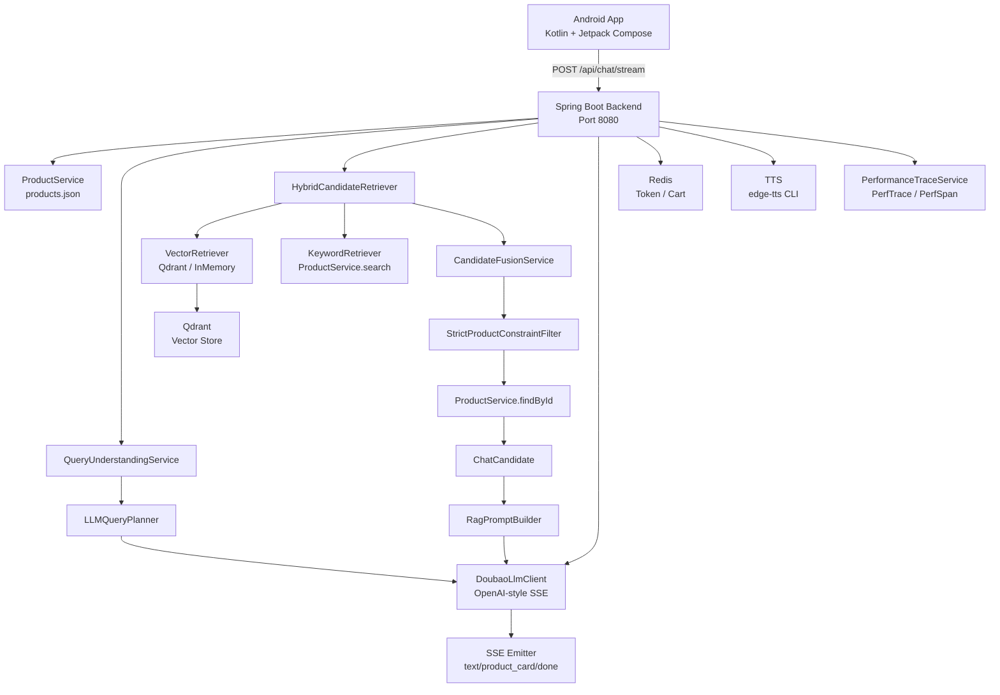

# 电商 RAG Agent 项目中期技术报告

---

## 1. 项目概述

### 1.1 项目定位

本项目是一个**电商导购型 RAG Agent**，目标是在 Android 客户端中通过自然语言对话为用户提供可信的商品推荐。系统核心约束是：**所有推荐商品必须来自商品库检索结果，LLM 不得凭空捏造商品、价格或功效**。

### 1.2 核心闭环

当前 Demo 已实现以下最小可上线闭环：

| 环节 | 说明 |
|------|------|
| 商品浏览 | Android 本地加载商品列表 |
| 悬浮智能助手 | 全局悬浮按钮唤起对话 |
| 商品推荐 | 基于 RAG 检索 + LLM 生成推荐理由 |
| 商品详情 | 查看完整商品信息 |
| 登录 | Demo 登录 + Bearer Token |
| 购物车 | Redis 存储，支持增删改查 |
| 对话式加购 | 通过 `/api/chat/stream` 语义识别加购 |
| 购物车问答 | 购物车金额查询、凑单推荐 |
| 语音输入 | Android 原生 SpeechRecognizer |
| TTS 语音播报 | edge-tts 合成，MediaPlayer 播放 |

### 1.3 当前阶段定位

当前处于**最小可上线闭环 + 待评估优化**阶段。后端 RAG Pipeline、Query Understanding、Android 客户端、MVP 部署配置均已完成，代码位于 `dev` 分支。

---

## 2. 系统总体架构



### 2.1 各组件职责

| 组件 | 职责 |
|------|------|
| Android App | Jetpack Compose UI、SSE 消费、Coil 图片加载、语音输入输出 |
| Spring Boot | 业务编排、API 路由、RAG Pipeline、会话管理 |
| products.json | 100 条商品数据，含 name/brand/category/price/description/specs/review_summary/faq_summary/marketing_copy |
| RAG Chunk 构建 | `RagDocumentBuilder` 将 Product 切分为 3-7 个 chunk |
| EmbeddingProvider | Mock / OpenAI-style / Ark-multimodal 三种实现 |
| Qdrant | 向量存储，支持 payload 过滤 |
| Hybrid Retrieval | Vector + Keyword 融合，0.65:0.35 权重 |
| LLMQueryPlanner | 基于 LLM 的结构化 QueryPlan 生成 |
| Doubao LLM Client | OpenAI-style SSE 流式调用 |
| Redis | Token 存储、购物车数据 |
| TTS | edge-tts CLI 合成 mp3 |
| SSE | 流式输出 text / product_card / done / error |

---

## 3. 前端模块与后端接口关系

### 3.1 接口清单

| 模块 | 接口 | 方法 | 认证 | 用途 |
|------|------|------|------|------|
| 健康检查 | `/api/health` | GET | 无需 | 服务状态 |
| 商品列表 | `/api/products` | GET | 无需 | 返回商品卡片列表（前端当前不依赖） |
| 商品详情 | `/api/products/{productId}` | GET | 无需 | 商品完整信息 |
| 商品搜索 | `/api/products/search` | POST | 无需 | 关键词搜索（前端当前不依赖） |
| 对话 | `/api/chat/stream` | POST | 可选 | SSE 流式对话，核心接口 |
| 登录 | `/api/auth/login` | POST | 无需 | Demo 登录，返回 Bearer Token |
| 购物车 | `/api/cart` | GET | 必须 | 查看购物车 |
| 购物车 | `/api/cart/items` | POST | 必须 | 加购 |
| 购物车 | `/api/cart/items/{productId}` | PATCH | 必须 | 修改数量 |
| 购物车 | `/api/cart/items/{productId}` | DELETE | 必须 | 移除商品 |
| 购物车 | `/api/cart` | DELETE | 必须 | 清空购物车 |
| TTS | `/api/tts/speak` | POST | 可选 | 语音合成 |
| TTS | `/api/tts/audio/{fileName}` | GET | 无需 | 获取音频文件 |

### 3.2 关键契约

- **字段命名**：所有请求体和响应体统一使用 `snake_case`
- **SSE 协议**：`data` 必须是单行 JSON，每次响应必须以 `done` 或 `error` 结束
- **认证**：`/api/cart/**` 必须登录；`/api/chat/stream` 可选认证，传有效 token 时启用对话式加购
- **ASR**：Android 原生 `SpeechRecognizer` 实现，识别结果直接作为普通文本走 `/api/chat/stream`，后端不实现 ASR

---

## 4. 后端核心模块说明

### 4.1 ProductService

- 加载 `classpath:data/products.json`
- 提供 `findById()`、`listAll()`、`search()`
- 字段加权评分：name(5) > subCategory(4) > category(3) > brand(3) > specs(2) > description(1)
- 为购物车、RAG、凑单推荐提供商品回填

### 4.2 AuthService / TokenStore

- Demo 登录：`demo` / `demo123`
- `RedisTokenStore` / `InMemoryTokenStore` 两种实现
- Bearer Token，默认有效期 7 天（`AUTH_TOKEN_TTL_SECONDS=604800`）

### 4.3 CartService

- Redis Hash 存储购物车（`RedisCartStore`）或内存存储（`InMemoryCartStore`）
- `CartView` / `CartItem` 结构，所有字段 `snake_case`
- 支持对话式加购、购物车问答、凑单推荐
- 凑单推荐由 `CartTopUpRecommendationService` 实现，按 `abs(gap - price)` 升序排序

### 4.4 ChatService

对话总编排层，核心流程：

```
接收 ChatRequest
  -> 获取认证用户 (AuthContextSnapshot)
  -> RetrievalRouter.route() 判断 intent
  -> QueryUnderstandingService.understandForRetrieval()
  -> HybridCandidateRetriever.retrieveWithAnalysis()
  -> 二次 StrictProductConstraintFilter 校验 -> finalCandidates
  -> ConversationMemoryService.updateAfterRetrieval()
  -> RagPromptBuilder.build()
  -> LlmClient.streamGenerate() (异步线程)
  -> sendProductCards() -> SSE done
```

### 4.5 TTS 模块

- `TtsService` 接收文本，调用 `EdgeTtsCliProvider` 合成
- `TtsAudioStore` 保存音频文件，24 小时自动清理
- 返回 `audio_url`，前端 `MediaPlayer` 播放
- TTS 失败不影响文字聊天主链路

---

## 5. RAG 数据构建与 Chunk 设计

### 5.1 原始商品数据

数据来源：`server/src/main/resources/data/products.json`

字段包括：`product_id`、`name`、`brand`、`category`、`sub_category`、`price`、`currency`、`image_url`、`description`、`specs`、`avg_rating`、`review_summary`、`faq_summary`、`marketing_copy`

JSON 使用 `snake_case`，Java 使用 `camelCase` + Jackson `@JsonProperty` 映射。

### 5.2 为什么需要 Chunk

电商商品是结构化 + 半结构化数据。为了让向量检索同时理解商品身份、描述、规格、综合卖点，需要把一个 Product 切成多个 `RagChunkDocument`，每个 chunk 聚焦不同语义维度。

### 5.3 当前 Chunk 类型

| Chunk 类型 | 用途 | 来源字段 | 生成条件 |
|------------|------|----------|----------|
| PRODUCT_PROFILE | 商品身份、品牌、类目、价格 | profile | 每个商品必生成 |
| DESCRIPTION | 商品描述，匹配语义需求 | description | 每个商品必生成 |
| SPECS | 规格参数，匹配属性需求 | specs | specs 非空时生成 |
| SEARCH_SUMMARY | 综合检索文本 | search_summary | 每个商品必生成 |
| REVIEW_SUMMARY | 用户评价语义 | review_summary | review_summary 非空时生成 |
| FAQ | 常见问答 | faq_summary | faq_summary 非空时生成 |
| MARKETING_COPY | 卖点语义 | marketing_copy | marketing_copy 非空时生成 |

每个 Product 约生成 3-7 个 chunk，100 个商品约 400-650 个 chunk。

### 5.4 Parent-Child RAG 设计

- **子块**用于向量检索
- **父文档**是完整 `Product`
- 检索命中 chunk 后，通过 `productId` 回填完整 Product
- 同一商品多个 chunk 命中时，通过 `productId` 聚合
- 这样既能提高召回粒度，又能保证推荐卡片信息完整

### 5.5 chunkId / vectorPointId

- **chunkId**：确定性 ID，格式 `{productId}::{chunkType}::{index}`
  - 示例：`p_beauty_001::DESCRIPTION::0`
- **vectorPointId**：基于 chunkId 生成的确定性 UUID v3
  - `UUID.nameUUIDFromBytes(("rag-chunk:" + chunkId).getBytes(UTF_8))`
- 重复 rebuild 不会导致 Qdrant point 重复膨胀，方便 upsert 覆盖

### 5.6 Qdrant Payload

Qdrant point 中存储：

- `vector`: text embedding
- `payload`: chunk_id, vector_point_id, product_id, parent_id, chunk_type, source_field, text, name, brand, category, sub_category, price, currency, avg_rating, image_url

Qdrant 存的不只是向量，还存完整 payload，用于 filter、debug 和回填。

---

## 6. Embedding 与向量索引流程

### 6.1 EmbeddingProvider

当前支持三种实现：

| 实现 | 配置 | 说明 |
|------|------|------|
| MockEmbeddingProvider | `EMBEDDING_PROVIDER=mock` | 文本 hash -> 确定性伪向量，默认 64 维 |
| OpenAIStyleEmbeddingProvider | `EMBEDDING_PROVIDER=openai-style` | 兼容 OpenAI /v1/embeddings |
| ArkMultimodalEmbeddingProvider | `EMBEDDING_PROVIDER=ark-multimodal` | 火山 Ark /embeddings/multimodal |

统一接口：`embed(String)` / `embedBatch(List<String>)` / `dimension()`

### 6.2 RagVectorIndexService

Rebuild 流程：

```
ProductService.listAll()
  -> RagDocumentService.buildAllChunks()
  -> EmbeddingProvider.embedBatch(chunk.text)
  -> EmbeddedRagChunk
  -> VectorStoreService.upsert()
  -> Qdrant collection
```

Rebuild 时检查 `EMBEDDING_DIMENSION == QDRANT_VECTOR_SIZE`，不一致则失败。

### 6.3 QdrantVectorStoreService

- Collection 管理（`QdrantCollectionManager`）
- Upsert points（批量 500 条/批）
- Search（支持 `QdrantFilterBuilder` 构建 metadata filter）
- Count / Clear

### 6.4 索引相关 API

| 接口 | 方法 | 用途 |
|------|------|------|
| `/api/rag/vector-index/rebuild` | POST | 重新构建向量索引 |
| `/api/rag/vector-index/stats` | GET | 查看索引数量、embedding 模型和维度 |
| `/api/rag/vector-search` | POST | 直接测试向量搜索 |
| `/api/rag/chunks/preview` | GET | 预览 chunk |
| `/api/rag/chunks/product/{productId}` | GET | 查看某个商品生成的 chunk |
| `/api/rag/chunks/stats` | GET | 查看 chunk 类型统计 |

---

## 7. RAG 检索链路

以用户查询 **"给我推荐几款适合程序员的电脑"** 为例，后端完整链路如下：

### 7.1 QueryUnderstandingService

```
understandForRetrieval()
  |- understanding.legacy_analyzer
  |    |- RetrievalRouter.route() -> intent=PRODUCT_SEARCH
  |    └- QueryAnalyzer.analyze() -> category/subCategory/price/keywords
  |- understanding.semantic_hint
  |    └- CartSemanticFrameMatcher.match() -> 排除购物车语义
  |- understanding.llm_planner (如 enabled)
  |    |- planner.prompt_build
  |    |- planner.llm_call -> 调用 LLM 生成 QueryPlan JSON
  |    |- planner.parse -> QueryPlanJsonParser
  |    └- planner.validate -> QueryPlanValidator
  |- understanding.gating
  |    └- QueryPlanGatingService.decide() -> 判断是否使用 planner
  └- understanding.mapper (如 gate 通过)
       └- QueryPlanToAnalysisMapper.map() -> QueryAnalysisResult
```

**关键设计**：不是纯规则，也不是纯 LLM。是 **规则/语义 hint + LLM planner + validator/gating** 的组合。LLM 只负责理解和填结构化字段，不直接执行业务。真实商品推荐由后端检索产生。

### 7.2 HybridCandidateRetriever

```
query + QueryAnalysisResult
  -> VectorRetriever (如 vector enabled 且 index 非空)
  -> KeywordRetriever (如 keyword enabled 或 vector 为空)
  -> CandidateFusionService.merge()
  -> StrictProductConstraintFilter.filterCandidates()
  -> ProductService.findById 回填
  -> ChatCandidate list
```

### 7.3 VectorRetriever

- `vectorIndexService.search()` -> Qdrant ANN 搜索
- 使用 category/subCategory/brand/price/chunk_type 等 filter
- 命中 `VectorSearchHit`
- 支持 multi-query variants 去重聚合

### 7.4 KeywordRetriever

- `ProductService.listAll()` 全量遍历
- 字段加权评分：name(3) > brand(2) > desc(1)
- 支持 positiveKeywords、negativeKeywords、negativeBrands 加减分
- 作为 fallback 和 hybrid 补充

### 7.5 CandidateFusionService

- `VECTOR_WEIGHT = 0.65`，`KEYWORD_WEIGHT = 0.35`
- 同一商品多个 chunk 命中：`CHUNK_BONUS = 0.1`
- `finalScore = 0.65 * vectorScore + 0.35 * keywordScore`
- 按 finalScore 降序排序

### 7.6 StrictProductConstraintFilter

统一最终硬过滤入口：

| 检查项 | 规则 |
|--------|------|
| category | CategoryMatchService alias 匹配 |
| subCategory | 支持多子类目兼容 |
| minPrice / maxPrice | 区间过滤 |
| negativeBrands | Nike <-> 耐克 互相识别 |
| excludeProductIds | 直接移除 |
| negativeKeywords | name + description + specs 全字段检查 |

### 7.7 推荐数量控制

`RecommendationCountResolver`：

| 用户表达 | 返回卡片数 |
|----------|-----------|
| "推荐一款""推荐一个""哪款最好" | 1 |
| "推荐几款""有哪些" | 3 |
| 其他 | 3（默认） |

`displayLimit = min(requestedCount, maxProductCardLimit=3, request.limit)`

### 7.8 Prompt 与 LLM 生成

`RagPromptBuilder` 构造 System Prompt + 候选商品列表 + 用户问题。

**4 套输出模板**：

| 模式 | 触发条件 | 格式 |
|------|----------|------|
| SINGLE_RECOMMENDATION | 1 个 candidate | <=120字，一句话适合+一句话理由 |
| MULTI_RECOMMENDATION | 2-3 个 candidates | <=180字，bullet 列表 |
| NO_MATCH | 0 个 candidate | "没找到满足条件的商品，放宽条件再试试" |
| CURRENT_PRODUCT_QA | PRODUCT_DETAIL | 只回答当前商品，不推荐其他 |

**Prompt 约束**：
- 不得推荐候选列表外商品
- 不输出 product_id
- 不重复卡片已展示信息
- 不用直播/客服腔

---

## 8. 购物车类 Query Understanding

购物车语义采用 **Semantic Frame + Rule Match + LLM Assist Slot Filling** 三层结构：

| 意图 | 示例 | 处理 |
|------|------|------|
| ADD_TO_CART | "把第一款加入购物车" | resolveTargetProductId -> CartService.addItem |
| CART_SUMMARY | "当前购物车多少钱了" | CartService.getCart -> 文本回复 |
| AMOUNT_GAP_QUERY | "离2000还差多少" | 计算差额，仅 text，不发送 product_card |
| COMPLETION_RECOMMEND | "凑到1000块" | 差额计算 + CartTopUpRecommendationService |

**关键保障**：
- CartService 读取真实购物车金额，LLM 不编造金额
- CartTopUpRecommendationService 从 ProductService 按价格差距推荐，LLM 不编造 product_id
- 未登录用户返回"请先登录"提示

---

## 9. 接口清单与作用说明

### 9.1 健康检查

| 接口 | 方法 | 认证 | 用途 |
|------|------|------|------|
| `/api/health` | GET | 无需 | 服务运行状态 |

### 9.2 商品

| 接口 | 方法 | 认证 | 前端依赖 |
|------|------|------|----------|
| `/api/products` | GET | 无需 | 否（前端用本地 JSON） |
| `/api/products/{productId}` | GET | 无需 | 是 |
| `/api/products/search` | POST | 无需 | 否 |

### 9.3 RAG Chunk / Index / Search Debug

| 接口 | 方法 | 认证 | 用途 |
|------|------|------|------|
| `/api/rag/chunks/preview` | GET | 无需 | 预览 chunk |
| `/api/rag/chunks/product/{productId}` | GET | 无需 | 查看商品 chunk |
| `/api/rag/chunks/stats` | GET | 无需 | chunk 统计 |
| `/api/rag/vector-index/rebuild` | POST | 无需 | 重建向量索引 |
| `/api/rag/vector-index/stats` | GET | 无需 | 索引状态 |
| `/api/rag/vector-search` | POST | 无需 | 向量搜索测试 |
| `/api/rag/retrieval/debug` | GET | 无需 | 检索链路调试 |
| `/api/rag/understanding/plan` | POST | 无需 | Shadow mode 对比 |
| `/api/debug/perf/recent` | GET | 无需 | 查看最近性能 trace |

### 9.4 对话

| 接口 | 方法 | 认证 | 说明 |
|------|------|------|------|
| `/api/chat/stream` | POST | 可选 | SSE，text/product_card/done/error |

### 9.5 登录与购物车

| 接口 | 方法 | 认证 | 说明 |
|------|------|------|------|
| `/api/auth/login` | POST | 无需 | Demo 登录 |
| `/api/cart` | GET | 必须 | 查看购物车 |
| `/api/cart/items` | POST | 必须 | 加购 |
| `/api/cart/items/{productId}` | PATCH | 必须 | 修改数量 |
| `/api/cart/items/{productId}` | DELETE | 必须 | 移除商品 |
| `/api/cart` | DELETE | 必须 | 清空购物车 |

### 9.6 TTS

| 接口 | 方法 | 认证 | 说明 |
|------|------|------|------|
| `/api/tts/speak` | POST | 可选 | 语音合成 |
| `/api/tts/audio/{fileName}` | GET | 无需 | 获取音频 |

---

## 10. 一次完整请求链路示例

### 示例 1：普通商品推荐

**用户**："给我推荐几款适合程序员的电脑"

**流程**：
1. `ChatController.streamChat()` 接收请求
2. `ChatService.chat()` 创建 `PerfTrace`
3. `RetrievalRouter.route()` -> `PRODUCT_SEARCH`
4. `QueryUnderstandingService.understandForRetrieval()`
   - `QueryAnalyzer.analyze()` -> category=数码电子, subCategory=笔记本电脑
   - `LLMQueryPlanner.plan()` -> 生成 QueryPlan（如 enabled）
   - `QueryPlanGatingService.decide()` -> 选择 effectiveAnalysis
5. `HybridCandidateRetriever.retrieveWithAnalysis()`
   - `VectorRetriever.retrieveWithFilters()` -> Qdrant 搜索
   - `KeywordRetriever.retrieveWithSoftKeywords()` -> 关键词匹配
   - `CandidateFusionService.merge()` -> 融合排序
   - `StrictProductConstraintFilter.filterCandidates()` -> 硬过滤
6. `ChatService` 二次校验 -> `finalCandidates`
7. `ConversationMemoryService.updateAfterRetrieval()` -> 保存上下文
8. `RagPromptBuilder.build()` -> 构造 Prompt
9. 异步线程 `DoubaoLlmClient.streamGenerate()`
   - 流式输出 `text` 事件
   - onComplete -> `sendProductCards()` -> `product_card` 事件 -> `done`

### 示例 2：多轮约束

**用户**：
- 第 1 轮："推荐几款跑鞋" -> category=服饰运动, subCategory=跑步鞋
- 第 2 轮："要轻量的" -> 继承 category/subCategory, normalizedQuery="跑步鞋 轻量"
- 第 3 轮："1000元以下" -> 继承 category/subCategory, maxPrice=1000

**保障**：
- `ConversationState` 保存上下文
- `StrictProductConstraintFilter` 硬过滤价格
- `product_card` 与 Prompt candidates 一致

### 示例 3：对话式加购

**用户**：
- "推荐一款跑鞋" -> 返回 product_card（如 p_clothes_007）
- "把第一款加入购物车"

**流程**：
1. `RetrievalRouter.route()` -> `ADD_TO_CART`
2. `ChatService.handleAddToCart()`
3. `resolveTargetProductId()`：
   - "第一款" -> `ConversationState.recommendedProductIds[0]` -> p_clothes_007
4. 检查 `authContext.isAuthenticated()`
5. `CartService.addItemAndReturn()` -> Redis 存储
6. SSE 返回："已加入购物车：Nike Air Zoom Pegasus 41，¥899，数量 x1"

### 示例 4：购物车凑单

**用户**：
- "当前购物车多少钱了"
- "如果要凑1000块，有没有推荐商品"

**流程**：
1. `RetrievalRouter.route()` -> `CART_SUMMARY` / `CART_TOP_UP`
2. `ChatService.handleCartSummary()` -> `CartService.getCart()` -> 返回金额
3. `ChatService.handleCartTopUp()`
   - `parseTargetAmount("凑1000块")` -> 1000
   - `CartService.getCart()` -> currentAmount
   - gap = 1000 - currentAmount
   - `CartTopUpRecommendationService.recommend()` -> 按 abs(gap - price) 排序
   - SSE 返回 text + product_card(s) + done

### 示例 5：TTS

```
SSE done
  -> 前端提取 AI 文本
  -> POST /api/tts/speak {text, voice}
  -> TtsService -> EdgeTtsCliProvider -> mp3 文件
  -> 返回 audio_url
  -> 前端 MediaPlayer 播放
```

---

## 11. 当前性能观测

### 11.1 Perf Trace 能力

已实现完整的性能埋点链路：

| 组件 | 说明 |
|------|------|
| `PerfTrace` | 单次请求完整追踪（traceId、endpoint、spans、attributes） |
| `PerfSpan` | 单个耗时阶段（name、startNanos、endNanos、durationMs） |
| `PerfTraceContext` | ThreadLocal 上下文，提供 startSpan/endSpan/mark/addAttribute |
| `PerformanceTraceService` | 创建 trace、保存 recent ring buffer、输出结构化日志 |

### 11.2 各阶段耗时（基于 perf trace）

| 阶段 | Span 名称 | 说明 |
|------|-----------|------|
| 总入口 | `/api/chat/stream` | 从请求进入到 SSE done |
| 意图路由 | `chat.route_intent` | RetrievalRouter |
| Query Understanding | `understanding.total` | 含 legacy + planner + gating |
| Legacy Analyzer | `understanding.legacy_analyzer` | QueryAnalyzer |
| Semantic Hint | `understanding.semantic_hint` | CartSemanticFrameMatcher |
| LLM Planner | `understanding.llm_planner` | LLMQueryPlanner（约 10s，主要瓶颈） |
| Gating | `understanding.gating` | QueryPlanGatingService |
| Mapper | `understanding.mapper` | QueryPlanToAnalysisMapper |
| Retrieval | `retrieval.total` | 含 vector + keyword + fusion + filter（约 1.7s） |
| Vector | `retrieval.vector` | VectorRetriever -> Qdrant |
| Keyword | `retrieval.keyword` | KeywordRetriever |
| Fusion | `retrieval.fusion` | CandidateFusionService |
| Constraint Filter | `retrieval.constraint_filter` | StrictProductConstraintFilter |
| Vector Embedding | `vector.query_embedding` | EmbeddingProvider.embed() |
| Qdrant Search | `qdrant.search_http` | Qdrant HTTP 调用（本身很快） |
| Prompt Build | `prompt.build` | RagPromptBuilder |
| LLM Total | `llm.total` | 从请求到流结束（约 6s） |
| HTTP Connect | `llm.http_connect_or_request` | DoubaoLlmClient HTTP 请求 |
| First Token | `llm.first_token` | 首 token 到达时间 |
| TTS | - | done 后异步发生，不影响主链路 |

### 11.3 当前瓶颈

| 瓶颈 | 耗时 | 说明 |
|------|------|------|
| LLMQueryPlanner | ~10s | 额外调用一次 LLM，延迟大 |
| Final LLM | ~6s | 流式生成，首 token 延迟是关键 |
| Retrieval Total | ~1.7s | 含 embedding + qdrant + keyword + fusion |
| Qdrant Search | <100ms | 本身很快，主要耗时在 embedding |

---

## 12. 当前能力边界

| 边界 | 说明 |
|------|------|
| 商品数据量 | 当前 100 条商品，适合 demo，不是大规模生产搜索 |
| Rerank | 当前为规则融合（0.65 vector + 0.35 keyword），没有 BGE reranker |
| LLMQueryPlanner 延迟 | 可能带来较大额外延迟，默认 `enabled=false` |
| Simple Fast Path | 闲聊/帮助等 non-retrieval intent 有固定回复，但商品推荐仍需完整 RAG 链路 |
| Redis 依赖 | 购物车和 token 依赖 Redis，未启动时相关测试失败 |
| ConversationState | 当前 `InMemoryConversationMemoryService`，服务重启丢失 |
| TTS | 依赖 edge-tts 外部服务，网络不稳时可能失败 |
| ASR | 依赖 Android 设备系统语音识别能力 |
| 图片找货 | 暂未实现 |
| 多副本/负载均衡 | 未实现 |
| CI/CD | 未实现 |
| 监控/告警 | 未实现 |

---

## 13. 下一步优化建议

### P0：性能优化

| 建议 | 说明 |
|------|------|
| ProductSemanticFrame Fast Path | 高频商品类目（如"洗面奶""跑鞋"）走预定义语义框架，跳过 LLM Planner |
| Planner Cache | 对相同/相似 query 缓存 QueryPlan，减少 LLM 调用 |
| Simple Recommendation Response | 低置信度 query 直接返回检索结果卡片，不调用 Final LLM |
| 正确记录 Final LLM first token | 当前 `llm.first_token` mark 已添加，需验证准确性 |
| 拆分 retrieval.vector 耗时 | 进一步拆分 `embedding.batch` 和 `qdrant.search_http` |

### P1：RAG 检索质量优化

| 建议 | 说明 |
|------|------|
| Query rewrite 策略优化 | 当前 `SoftSemanticLexicon` 22 条，可扩展 |
| Chunk text 数据增强 | 增加更多语义关键词到 SEARCH_SUMMARY |
| 品类感知凑单 | 凑单推荐时考虑 category 一致性 |
| BGE reranker | 引入轻量级 reranker 精排 |
| Hybrid score 权重调参 | 根据评估集调优 0.65:0.35 |
| 检索评估集 | 扩展 `/api/rag/eval` 评估 query 覆盖 |

### P1：多模态图片找货

| 建议 | 说明 |
|------|------|
| POST /api/vision/search | 接收图片 URL 或 base64 |
| VLM 识别图片属性 | 调用多模态模型生成商品属性描述 |
| 生成 QueryPlan | 复用现有 LLMQueryPlanner |
| 复用 RAG 检索 | 复用 HybridCandidateRetriever |

### P2：状态持久化

| 建议 | 说明 |
|------|------|
| ConversationState Redis 持久化 | 替代 InMemoryConversationMemoryService |
| 推荐历史和排除逻辑持久化 | 跨会话保持用户偏好 |

### P2：部署上线

| 建议 | 说明 |
|------|------|
| Docker Compose | backend + Qdrant + Redis |
| Nginx / HTTPS | SSE 专用配置（proxy_buffering off 等） |
| .env 管理 | `deploy/.env.production` 已提供模板 |
| TTS edge-tts 部署验证 | Dockerfile 已安装 python3 + edge-tts |

---

## 14. 总结

当前电商 RAG Agent 项目已完成**最小可上线闭环**，核心能力包括：

1. **RAG 检索链路**：Parent-Child Chunk -> Embedding -> Qdrant -> Hybrid Retrieval -> Constraint Filter
2. **Query Understanding**：Legacy Analyzer + LLMQueryPlanner (shadow/assist) + Gating
3. **对话系统**：SSE 流式输出，支持 text / product_card / done / error
4. **购物车**：对话式加购、金额查询、凑单推荐
5. **语音**：TTS 合成，ASR 由 Android 原生实现
6. **性能观测**：PerfTrace / PerfSpan，支持日志和调试 API

**当前最大瓶颈**是 LLMQueryPlanner 带来的额外 LLM 调用延迟（约 10s），以及 Final LLM 首 token 延迟（约 6s）。后续优化应优先解决性能问题，再逐步提升检索质量和多模态能力。
