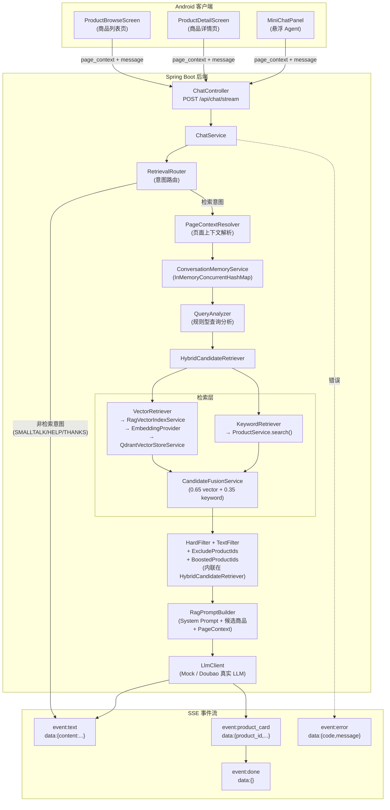
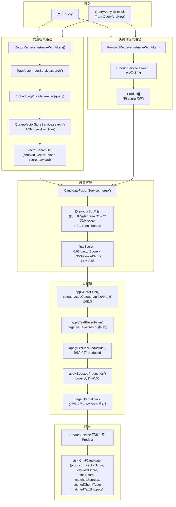

# RAG 多模态电商智能体导购中期开发报告

> 生成时间：2026-06-01
> 报告范围：Backend RAG Pipeline 全链路（商品数据 → Chunk → Embedding → Qdrant → Hybrid Retrieval → QueryAnalyzer → LLM → SSE）
> 本报告仅描述已实现功能，未实现/部分实现的功能会在各章节末尾明确标注。

---

## 1. 项目当前整体状态概述

### 1.1 演进过程

项目从最初的单文件聊天 Demo 已经演进了七个阶段：

| 阶段 | 日期 | 核心产出 |
|------|------|----------|
| Backend MVP 骨架 | 2026-05-23 | Spring Boot 3 + Maven 工程、健康检查 API |
| 商品数据层 | 2026-05-23 | 12 字段 Product schema、100 条商品 JSON、商品搜索 API |
| RAG Pipeline 雏形 | 2026-05-23 | CandidateRetriever + RagPromptBuilder + MockLlmClient + SSE |
| 真实 LLM 接入 | 2026-05-24 | DoubaoLlmClient（OpenAI-style SSE 流式解析）、Mock/Doubao 切换 |
| Parent-Child Chunk | 2026-05-25 | RagChunkDocument + ChunkType + RagDocumentBuilder + 确定性 chunkId |
| Embedding + Qdrant | 2026-05-26 | EmbeddingProvider 抽象、Mock/OpenAI-style/Ark-multimodal 三种实现、QdrantVectorStoreService |
| Hybrid Retrieval | 2026-05-26 | VectorRetriever + KeywordRetriever + CandidateFusionService + HybridCandidateRetriever |
| RetrievalRouter + 多轮 | 2026-05-27 | 意图路由（9 种 intent）、ConversationState、Contextual QueryAnalyzer、Negative Constraints |
| PageContext-aware | 2026-06-01 | page_context 字段、PageContextResolver、PRODUCT_DETAIL/PRODUCT_LIST 上下文感知检索 |
| Query Rewrite | 2026-06-02 | SoftSemanticLexicon (22 条) + LLMQueryRewriter + QueryRewriteService (4 模式) |
| QueryPlan 基础设施 | 2026-06-02 | CatalogTaxonomyService + QueryPlan (20+ 字段) + QueryPlanValidator |
| LLMQueryPlanner | 2026-06-02 | LLM 填充 QueryPlan、shadow mode、QueryUnderstandingService |
| QueryPlan Gate + Mapper | 2026-06-02 | QueryPlanGatingService、QueryPlanToAnalysisMapper、assist/takeover mode |
| ChatService Shadow | 2026-06-02 | ChatService 接入 QueryUnderstandingService，shadow 语义 |
| ChatService Assist | 2026-06-03 | assist mode 局部接管、plannerUsedForRetrieval=true、619 测试通过 |
| **Android 客户端** | 2026-05-24~06-03 | Kotlin + Jetpack Compose、SSE 消费、ProductDetailScreen、悬浮 Agent 入口、商品浏览页 |
| **最小上线闭环** | 2026-06-03 | Dockerfile、Docker Compose、Nginx HTTPS、Smoke Test、部署文档 |

### 1.2 当前完整链路（Mermaid 流程图）



---

## 2. 商品数据与前后端数据对齐

### 2.1 后端商品数据来源

商品数据来源于老师提供的电商数据集，经 Python 脚本 `scripts/convert_teacher_dataset.py` 转换为标准 `products.json`，存放于 `server/src/main/resources/data/products.json`。

**数据量**: 100 条商品，覆盖 4 大类目：

| 类目 | 商品数 |
|------|--------|
| 美妆护肤 | ~25 |
| 数码电子 | ~25 |
| 服饰运动 | ~25 |
| 食品饮料 | ~25 |

### 2.2 Product 实体字段

| # | 字段 | Java 类型 | JSON Key | 说明 |
|---|------|-----------|----------|------|
| 1 | productId | String | product_id | 商品唯一 ID，如 p_beauty_001 |
| 2 | name | String | name | 商品名称 |
| 3 | brand | String | brand | 品牌（已清洗去重） |
| 4 | category | String | category | 主类目 |
| 5 | subCategory | String | sub_category | 子类目 |
| 6 | price | BigDecimal | price | 基础价格（元） |
| 7 | priceRange | String | price_range | 价格区间，如 "720~1260" |
| 8 | imageUrl | String | image_url | 图片路径，如 /images/p_beauty_001.jpg |
| 9 | description | String | description | 营销描述文本 |
| 10 | specs | Map\<String, String\> | specs | 规格参数 |
| 11 | avgRating | Double | avg_rating | 用户评分平均值 |
| 12 | currency | String | currency | 货币单位，固定 "CNY" |
| 13 | reviewSummary | String | review_summary | 用户评价摘要（脱敏聚合，可选） |
| 14 | faqSummary | String | faq_summary | 常见问答摘要（Q&A拼接，可选） |
| 15 | marketingCopy | String | marketing_copy | 卖点文案（可选） |

### 2.3 Android assets/products.json 与后端 products.json 的对齐

- Android 客户端内置 `client/android/app/src/main/assets/products.json`，与后端 `server/src/main/resources/data/products.json` 共享同一个数据源。
- **product_id 是前后端对齐的唯一主键**：Android 本地商品浏览、ProductDetailScreen 商品详情页、ChatScreen 商品卡片跳转均依赖 product_id。
- 后端商品详情接口 `GET /api/products/{productId}` 必须支持前端本地商品 ID 的查询。

### 2.4 图片路径 image_url

- 后端存储格式：`/images/{product_id}.jpg`（相对于 static 目录）
- 100 张商品图片存放在 `server/src/main/resources/static/images/`
- 前端访问时 Android App 自动拼接 baseUrl（`http://10.0.2.2:8080`）
- 图片加载使用 Coil 库，加载失败自动显示 placeholder

### 2.5 ProductService 的职责

| 职责 | 方法 |
|------|------|
| 数据加载 | `@PostConstruct init()` 从 classpath 加载 products.json |
| 商品查询 | `findById(String productId)` 通过 HashMap O(1) 查找 |
| 商品列表 | `listAll()` 返回全部商品 |
| 关键词检索 | `search(ProductSearchRequest)` 分词评分排序 |
| 商品卡片转换 | `toProductCard(Product)` / `toProductCards(List<Product>)` |
| 结构化过滤 | `filterByCategory/SubCategory/Brand/PriceRange` |

**关键词评分规则**:

| 命中字段 | 得分 |
|----------|------|
| name | +5 |
| subCategory | +4 |
| category | +3 |
| brand | +3 |
| specs (key/value) | +2 |
| description | +1 |

支持中英文混合分词（空格分词 + CJK 双字组合），query 按空格分词后每个 token 独立评分累加，仅返回 score > 0 的商品。

### 2.6 商品接口

| 接口 | 方法 | 说明 |
|------|------|------|
| `/api/products` | GET | 商品列表，支持 limit 参数 |
| `/api/products/{productId}` | GET | 商品详情（完整 12 字段） |
| `/api/products/search` | POST | 关键词+条件搜索（category/subCategory/brand/minPrice/maxPrice） |

### 2.7 商品卡片 ProductCard 与 Product 的关系

- `ProductCard` 是 Product 的视图投影，只包含 6 个字段：product_id / name / price / currency / image_url / reason
- `reason` 字段 MVP 阶段为空字符串
- **product_card SSE 事件必须来自后端 ProductService 查询结果，不允许 LLM 生成**

### 2.8 哪些字段进入 RAG，哪些字段只用于展示

| 用途 | 字段 |
|------|------|
| **进入 RAG 向量化** | name, description, specs, reviewSummary, faqSummary, marketingCopy, 组合生成的 profile/search_summary 文本 |
| **进入 Qdrant payload（过滤字段）** | product_id, category, sub_category, brand, price, chunk_type |
| **进入 LLM Prompt** | product_id, name, brand, category, sub_category, price, description |
| **仅用于展示（ProductCard）** | image_url, currency, reason |

---

## 3. Chunk 切分策略

### 3.1 为什么采用 Parent-Child RAG

本项目采用**商品实体中心的 Parent-Child Hybrid RAG** 设计：

1. **Product** 是 parent（父文档）—— 商品权威数据源
2. **RagChunkDocument** 是 child（子 chunk）—— 用于向量检索
3. child chunk 检索命中后，通过 `productId` 回填完整 Product
4. 多个 child chunk 可能对应同一个 product（最多 4 个 chunk/商品）
5. 检索后按 productId 聚合，避免同一商品多次出现在候选列表

### 3.2 当前 ChunkType 详细说明

| ChunkType | 来源字段 | 文本内容格式 | 主要解决什么检索问题 | 示例 |
|-----------|----------|-------------|---------------------|------|
| `PRODUCT_PROFILE` | name, brand, category, subCategory, price, avgRating | "商品名称：{name}\n品牌：{brand}\n类目：{category}\n子类目：{subCategory}\n价格：{price} CNY\n评分：{avgRating}\n商品定位：{category} {subCategory} {brand}" | 匹配商品整体身份、品牌、类目、价格段 | `商品名称：雅诗兰黛小棕瓶\n品牌：雅诗兰黛\n类目：美妆护肤\n子类目：精华\n价格：720.0 CNY\n评分：2.2\n商品定位：美妆护肤 精华 雅诗兰黛` |
| `DESCRIPTION` | description | "商品名称：{name}\n商品描述：{description}" | 匹配语义需求（如"油皮""保湿""抗初老"） | `商品名称：芙丽芳丝净润洗面霜\n商品描述：温和氨基酸洁面，适合敏感肌和油皮...` |
| `SPECS` | specs | "商品名称：{name}\n规格参数：{specs key: value 逐行}" | 匹配规格属性（如"30ml""蓝牙5.3""500ml"） | `商品名称：iPhone 15\n规格参数：颜色：黑色、白色\n存储：128GB、256GB` |
| `SEARCH_SUMMARY` | 所有字段拼接 | 拼接 name + brand + category + subCategory + description + specs | 综合检索，提高召回稳定性，兜底覆盖 | `雅诗兰黛 小棕瓶 精华 美妆护肤 抗初老 夜间修护 30ml 50ml 75ml` |
| `REVIEW_SUMMARY` | reviewSummary | "商品用户评价摘要：\n商品名称：{name}\n品牌：{brand}\n类目：{category}/{subCategory}\n平均评分：{avgRating}\n评价摘要：{reviewSummary}" | 匹配用户评价语义（如"好用吗""反馈""闷痘""偏码"） | `商品用户评价摘要：\n商品名称：某精华\n品牌：某品牌\n类目：美妆护肤/精华\n平均评分：4.5\n评价摘要：整体评分约4.5分，代表性反馈：1）温和不刺激...` |
| `FAQ` | faqSummary | "商品常见问答：\n商品名称：{name}\n品牌：{brand}\n类目：{category}/{subCategory}\n问答信息：{faqSummary}" | 匹配常见问题（如"能装电脑吗""适合敏感肌""支持某功能"） | `商品常见问答：\n商品名称：某背包\n品牌：某品牌\n类目：服饰运动/背包\n问答信息：Q:能装15寸电脑吗？A:可以，有独立电脑仓...` |
| `MARKETING_COPY` | marketingCopy | "商品卖点文案：\n商品名称：{name}\n品牌：{brand}\n类目：{category}/{subCategory}\n核心卖点：{marketingCopy}" | 匹配卖点/场景/人群/功能/材质/亮点语义 | `商品卖点文案：\n商品名称：某面霜\n品牌：某品牌\n类目：美妆护肤/面霜\n核心卖点：年度畅销TOP1，补水效果立竿见影...` |

### 3.3 chunkId 和 vectorPointId 规则

**chunkId 格式**：`{productId}::{chunkType}::{index}`

示例：
- `p_beauty_001::PRODUCT_PROFILE::0`
- `p_beauty_001::DESCRIPTION::0`
- `p_beauty_001::SPECS::0`
- `p_beauty_001::SEARCH_SUMMARY::0`

**vectorPointId 生成**：
```java
UUID.nameUUIDFromBytes(("rag-chunk:" + chunkId).getBytes(StandardCharsets.UTF_8)).toString()
```
同一 chunkId 每次生成相同 vectorPointId（确定性 UUID v3），用作 Qdrant point id。

### 3.4 当前优势

1. **电商数据天然有明确字段**：不需要像普通 PDF 那样固定窗口切分
2. **按商品属性和字段语义切分更可解释**：每种 ChunkType 有明确的检索目的
3. **确定性 ID**：chunkId 和 vectorPointId 均可复现，便于增量更新和 debug
4. **Parent-Child 模式**：向量检索命中 chunk 后回填完整 Product，保证信息完整性

### 3.5 当前不足

1. description 文本超过 800 字会被截断，可能丢失尾部信息
2. 后续可接入图片找货（Ark 多模态接口已预留 image_url 类型）

---

## 4. 非结构化数据向量化方案

### 4.1 完整向量化链路

```
Product (12 字段)
  → RagDocumentBuilder.buildChunks(product)
    → 生成 3~4 个 RagChunkDocument（SPECS 仅在非空时生成）
      → RagChunkDocument.text 送入 EmbeddingProvider
        → 当前真实 provider: ArkMultimodalEmbeddingProvider
          → 生成 vector (List<Double>)
            → 封装为 EmbeddedRagChunk (chunk + vector + payload)
              → QdrantVectorStoreService.upsert()
                → 写入 Qdrant point
```

### 4.2 EmbeddingProvider 三种实现

| Provider | 环境变量值 | 说明 | 调用方式 |
|----------|-----------|------|----------|
| `MockEmbeddingProvider` | `mock`（默认） | 文本 hash → 确定性伪向量，L2 归一化，默认 64 维 | 本地，无 API 调用 |
| `OpenAIStyleEmbeddingProvider` | `openai-style` | 兼容 OpenAI /v1/embeddings 接口 | POST /v1/embeddings |
| `ArkMultimodalEmbeddingProvider` | `ark-multimodal` | 火山 Ark /embeddings/multimodal 接口 | POST /embeddings/multimodal |

### 4.3 Ark 多模态 Embedding 详细说明

- **接口路径**：`{EMBEDDING_BASE_URL}/embeddings/multimodal`（路径通过 `ARK_MULTIMODAL_EMBEDDING_PATH` 可配置）
- **请求体格式**：input 为对象数组 `[{"type":"text","text":"..."}]`，而非字符串数组
- **当前只使用 text 类型**：`{"type": "text", "text": "商品描述..."}`
- **image_url 类型预留但未接入**：`{"type": "image_url", "image_url": "https://..."}` 可传但当前未使用（图片找货未实现）
- **维度一致性**：`EMBEDDING_DIMENSION` 必须等于 `QDRANT_VECTOR_SIZE`，rebuild 时会校验

### 4.4 Qdrant Point 结构

- **vector**：用于语义相似度检索（余弦相似度）
- **payload**：用于过滤、回填和 debug，保存结构化字段
- **ProductService**：仍然是商品权威数据来源，向量检索只提供候选集

Qdrant point JSON 示例：

```json
{
  "id": "a1b2c3d4-e5f6-7890-abcd-ef1234567890",
  "vector": [0.0123, -0.0456, 0.0789, ...],
  "payload": {
    "product_id": "p_beauty_001",
    "chunk_type": "PRODUCT_PROFILE",
    "name": "雅诗兰黛特润修护肌活精华露...",
    "brand": "雅诗兰黛",
    "category": "美妆护肤",
    "sub_category": "精华",
    "price": 720.0,
    "currency": "CNY",
    "avg_rating": 2.2,
    "image_url": "/images/p_beauty_001.jpg",
    "text": "商品名称：雅诗兰黛...\n品牌：雅诗兰黛...",
    "source_field": "profile"
  }
}
```

---

## 5. Embedding 与 Qdrant 实现

### 5.1 EmbeddingProvider 接口

```java
public interface EmbeddingProvider {
    List<Double> embed(String text);
    List<List<Double>> embedBatch(List<String> texts);
    int dimension();
    String modelName();
}
```

### 5.2 ArkMultimodalEmbeddingProvider 详细实现

**调用路径**：`POST {baseUrl}/embeddings/multimodal`

**请求体格式**：
```json
{
  "model": "doubao-embedding-vision-251215",
  "input": [
    {"type": "text", "text": "商品名称：芙丽芳丝净润洗面霜\n商品描述：温和氨基酸洁面..."}
  ]
}
```

**关键实现细节**：
- 使用 `java.net.http.HttpClient`，不依赖第三方 HTTP 库
- `embedBatch()` 目前逐条调用 API（非真实批量），受 `EMBEDDING_BATCH_SIZE` 控制单次文本数
- 错误处理：401（认证失败）、429（频率超限）、5xx（服务异常）均给出清晰错误信息
- **不输出 API Key 到日志**

### 5.3 VectorStoreService 两种实现

| 实现 | 配置值 | 说明 |
|------|--------|------|
| `InMemoryVectorStoreService` | `in-memory`（默认） | ConcurrentHashMap + Cosine Similarity，本地运行，零依赖 |
| `QdrantVectorStoreService` | `qdrant` | Qdrant REST API（Java HttpClient），支持 filter 和 score_threshold |

### 5.4 QdrantVectorStoreService 详细说明

| 操作 | HTTP 方法 | Qdrant API |
|------|-----------|------------|
| 创建 collection | PUT | `/collections/{name}` |
| 批量 upsert | PUT | `/collections/{name}/points?wait=true`（每批 500） |
| 向量搜索 | POST | `/collections/{name}/points/search` |
| 统计数量 | POST | `/collections/{name}/points/count` |
| 清空 | DELETE | `/collections/{name}` |

**filter 构造**：通过 `QdrantFilterBuilder` 将 Java 条件（category/sub_category/brand/product_id/chunk_type/min_price/max_price）转换为 Qdrant filter JSON。

---

## 6. QueryAnalyzer 设计

### 6.1 设计思路

1. **当前是规则型 QueryAnalyzer**，不调用 LLM
2. 负责解析**硬约束**：类目、子类目、价格区间、品牌排除、否定关键词
3. 解析结果进入 `QueryAnalysisResult`，后续进入 `HybridCandidateRetriever` 的 filter 链
4. 价格、品牌、排除条件这类硬约束**不交给 LLM 猜**，由规则引擎精确控制

### 6.2 当前支持的规则类型

| 规则 | 触发条件 | 解析结果 |
|------|----------|----------|
| 类目识别 | 关键词映射（如 "洗面奶" → 美妆护肤/洁面） | category, subCategory |
| 子类目识别 | 同上 IDIOM_MAP | subCategory |
| 价格解析 | "预算{数字}""{数字}以内/以下/左右" | maxPrice / minPrice |
| 负向品牌 | "除了{品牌}""不要{品牌}""不含{成分}" | negativeBrands, negativeKeywords |
| 学生党 | "学生党""学生" | positiveKeywords += [性价比, 低价, 实用] |
| 通勤/轻量/油皮/敏感肌 | "通勤""轻量""油皮""敏感肌""干皮" | positiveKeywords += 对应软语义关键词 |
| 多轮 refinement | "要轻量的""更便宜""预算再加点" | 继承上轮 context.category, context.subCategory 等 |
| PageContext 融合 | "这个/这款/它" → currentProductId | currentProductId, boostedProductIds, pageSearchQuery |
| excludeProductIds | "换一个""还有吗" → 上一轮推荐 | excludeProductIds |

### 6.3 QueryAnalyzer 三个重载方法

```java
// 单轮分析
QueryAnalysisResult analyze(String query);

// 多轮上下文分析（ConversationState）
QueryAnalysisResult analyze(String query, ConversationState context);

// 多轮 + PageContext 分析
QueryAnalysisResult analyze(String query, ConversationState context, PageContextResolution pageContext);
```

三个方法形成管道：`analyze(query)` → 基础分析 → `analyze(query, context)` → 追加上下文继承 → `analyze(query, context, pageContext)` → 追加 PageContext 分析。

### 6.4 典型示例

**示例 1：基础分析**
```
输入：推荐跑鞋
输出：category=服饰运动, subCategory=跑步鞋
```

**示例 2：多轮上下文继承**
```
第一轮：推荐跑鞋
  → category=服饰运动, subCategory=跑步鞋
第二轮：要轻量的
  → 继承 category=服饰运动, subCategory=跑步鞋, positiveKeywords=[轻量]
```

**示例 3：价格约束**
```
输入：预算1000以内
输出：maxPrice=1000
```

**示例 4：负向品牌**
```
输入：除了耐克
输出：negativeBrands=[耐克, Nike]
```

**示例 5：PageContext 当前商品**
```
输入：这个适合敏感肌吗？
PageContext: PRODUCT_DETAIL, currentProductId=p_beauty_001
输出：currentProductId=p_beauty_001, 设置 inheritedFromPageContext=true
```

---

## 7. 是否需要 LLM Query Rewrite

### 7.1 当前为什么没有 LLM Query Rewrite

1. **当前核心问题是硬约束解析**：价格区间、品牌排除、类目过滤是电商检索的刚性需求
2. **价格、品牌、否定语义用规则更稳定**：LLM rewrite 有可能引入不确定性（如将"除了耐克" rewrite 后丢失排除语义）
3. **当前 RAG 已能通过 QueryAnalyzer + Hybrid Retrieval 解决主要单轮和多轮约束**
4. **QueryAnalyzer 的 IDIOM_MAP 覆盖了主流电商搜索口语**（洗面奶→洁面、跑鞋→跑步鞋、蓝牙耳机→无线耳机 等）

### 7.2 LLM Query Rewrite / Query Expansion（已实现）

> **状态：已实现（2026-06-02），默认 disabled**

LLM Query Rewrite 定位为软语义扩展层，不替代 QueryAnalyzer：

- `SoftSemanticLexicon`：22 条种子映射（学生党→性价比/低价/实用、通勤→轻量/便携、敏感肌→温和/舒缓/修护 等）
- `LLMQueryRewriter`：通过 LlmClient 调用 LLM 生成 JSON 格式 rewrite 结果
- `QueryRewriteService`：支持 disabled/lexicon/llm/hybrid 四种 provider，LRU cache 500 条
- `QueryRewriteValidator`：限制 variant/keyword 数量、去重、移除价格表达和 forbidden 前缀
- **默认 enabled=false, provider=lexicon**（仅词表映射，不调用 LLM）
- **最终硬过滤仍然由 QueryAnalyzer 和 StrictProductConstraintFilter 控制**

### 7.3 QueryPlan 基础设施（全部阶段已完成）

> **状态：全部 4 个阶段已实现（Phase 1-4B），assist mode 可用。**

当前 QueryAnalyzer 完全依赖规则、关键词和正则。随着商品类目和用户表达增多，持续的规则扩展越来越笨重。例如：
- "推荐几款适合程序员的电脑" → 无法稳定解析 category=数码电子, subCategory=笔记本电脑
- "一万元以下的" → 无法稳定识别 REFINE_PREVIOUS_QUERY + maxPrice=10000

因此实现了如下升级路径：

```
用户 query + page_context + conversation_state
→ LLMQueryPlanner 填充结构化 QueryPlan
→ QueryPlanValidator 校验类目/价格/品牌
→ QueryUnderstandingService 融合 LLM plan + legacy fallback
→ QueryPlanGatingService gate 决策 (assist/takeover/shadow/disabled)
→ QueryPlanToAnalysisMapper 映射 → QueryAnalysisResult
→ HybridRetriever 执行检索
→ StrictProductConstraintFilter 最终硬过滤
```

已完成全部四个阶段的**基础设施**：

| 类 | 职责 |
|----|------|
| `CatalogTaxonomyService` | 从 ProductService 动态统计 categories/subCategories/brands/价格范围 |
| `CatalogTaxonomySnapshot` | taxonomy 快照（categories, subCategoriesByCategory, brands, minPrice, maxPrice, filterableFields, textFields） |
| `QueryPlan` | 结构化 intent schema（20+ 字段：intent, needsRetrieval, target, price, brands, attributes, softKeywords, queryVariants, answerMode 等） |
| `QueryPlanTarget/Price/Brands/Attributes` | 子结构（category/subCategory/scopeProductIds/excludeProductIds, min/max/currency/strict, include/exclude） |
| `QueryPlanValidator` | 校验 category/subCategory/price/brands/variants/keywords 合法性，轻量修正 |
| `QueryPlanValidationResult` | 校验结果（originalPlan, validatedPlan, valid, warnings, errors, fixedFields, categoryMatched, subCategoryMatched, priceValid, brandValid） |
| `LLMQueryPlanner` | 编排 prompt→LlmClient→parse→validate 全流程，超时保护，返回 QueryPlanningResult |
| `QueryPlannerPromptBuilder` | 构造 planner prompt：注入 taxonomy + conversation_state + page_context + QueryPlan schema + 12 条规则 |
| `QueryPlanJsonParser` | LLM 输出 JSON 提取：纯 JSON / ```json fence / 前后说明文字 |
| `QueryPlanningResult` | 结果 POJO：plannerEnabled/mode/rawPlan/validatedPlan/parseSuccess/valid/latencyMs/source |
| `QueryPlanToAnalysisMapper` | 15 个映射规则：QueryPlan → QueryAnalysisResult（category/subCategory/price/brands/attributes/softKeywords/queryVariants/responseStyle） |
| `QueryPlanGateDecision` | gate 决策结果（allowed/selectedSource/reason/fallbackReasons/confidence/valid/hasErrors/mode） |
| `QueryPlanGatingService` | assist/takeover gate 逻辑：confidence 阈值、intent 白名单、legacy incomplete 检测、severe warnings fallback |
| `QueryUnderstandingResult` | 统一结果：query + legacyAnalysis + planningResult + gateDecision + effectiveAnalysis + selectedSource + fallbackReason + plannerUsedForRetrieval |
| `QueryUnderstandingService` | 编排 legacy QueryAnalyzer + LLMQueryPlanner + gate + mapper，产出 effectiveAnalysis |

**ChatService 集成（Phase 4A/B）**：
- ChatService 注入 QueryUnderstandingService，检索路径改为 `understandForRetrieval()`
- assist mode 下 `gateDecision.allowed=true` 时使用 planner effectiveAnalysis（plannerUsedForRetrieval=true, selectedSource=PLANNER）
- shadow/disabled 模式下使用 legacyAnalysis（plannerUsedForRetrieval=false）
- ConversationState 保存 effectiveAnalysis 的 category/subCategory/maxPrice/positiveKeywords，多轮 refine 可读取 planner 上下文
- Debug controller 与 ChatService 使用同一 `QueryUnderstandingService.understand()` 入口

**Debug API**：
- `GET /api/rag/understanding/taxonomy` — 查看当前 taxonomy
- `POST /api/rag/understanding/validate-plan` — 校验 QueryPlan JSON
- `POST /api/rag/understanding/plan` — shadow mode 对比：legacy analysis + LLM planner result
- `GET /api/rag/retrieval/debug` — 输出 legacy_analysis/planner_result/validated_plan/gate_decision/effective_analysis/selected_source/planner_used_for_retrieval/fallback_reason

**配置（application.yml）**：
```yaml
app.understanding.planner:
  enabled: false          # 默认关闭（稳定优先）
  mode: shadow            # shadow / assist / takeover
  timeout-seconds: 10
  min-confidence: 0.85
  allow-takeover-intents: PRODUCT_SEARCH,REFINE_PREVIOUS_QUERY,NEGATIVE_CONSTRAINT,CHANGE_OR_MORE,CURRENT_PRODUCT_QA
  fallback-on-warnings: true
  fallback-on-unknown-category: true
  fallback-on-unknown-sub-category: true
```

**重要承诺**：
- **Phase 1-4B 全部完成**：CatalogTaxonomyService → QueryPlan → QueryPlanValidator → LLMQueryPlanner → Gate → Mapper → ChatService 集成
- **assist mode 仅在 legacy 不完整 + planner 高置信度合法时接管**，legacy 完整时优先 legacy
- **StrictProductConstraintFilter 仍然保持最终硬过滤**
- **默认 planner enabled=false**（通过 `QUERY_PLANNER_ENABLED` 环境变量开启）
- **不修改 SSE 协议、不修改 Android 客户端**

---

## 8. RetrievalRouter 与不检索回答

### 8.1 不需要检索的 Intent

| Intent | 触发条件 | 示例 | ChatService 行为 |
|--------|----------|------|-----------------|
| `SMALLTALK` | "你好""在吗""hello""你是谁" | "你好" | 直接返回预设文本，不调用检索 |
| `HELP` | "怎么用""你能做什么""帮助""功能" | "你能做什么？" | 直接返回预设文本，不调用检索 |
| `THANKS` | "谢谢""好的""知道了""ok" | "谢谢！" | 直接返回预设文本，不调用检索 |

### 8.2 所有 Intent 类型

| Intent | 说明 | 是否检索 |
|--------|------|----------|
| `SMALLTALK` | 寒暄 | 否 |
| `HELP` | 帮助询问 | 否 |
| `THANKS` | 感谢 | 否 |
| `PRODUCT_SEARCH` | 商品搜索 | 是 |
| `REFINE_PREVIOUS_QUERY` | 补充条件/修正 | 是 |
| `NEGATIVE_CONSTRAINT` | 否定约束 | 是 |
| `CHANGE_OR_MORE` | 换一个/还有吗 | 是 |
| `COMPARE_PRODUCTS` | 商品对比 | 是（仅标记，对比逻辑未完整实现） |
| `UNKNOWN` | 无法识别 | 是（兜底检索） |

### 8.3 ChatService 分流逻辑

```
RetrievalRouter.route(query)
  → intent in [SMALLTALK, HELP, THANKS]
    → handleNonRetrievalIntent() → 直接 SSE text → done
  → 其他 intent
    → PageContextResolver.resolve()
    → QueryAnalyzer.analyze(query, state, pageContext)
    → HybridCandidateRetriever.retrieveWithAnalysis()
    → RagPromptBuilder.build()
    → LlmClient.streamGenerate()
    → SSE text + product_card + done
```

---

## 9. Hybrid Retrieval 检索流程

### 9.1 完整检索步骤



### 9.2 融合策略详解

**CandidateFusionService.merge()**：

```
1. 遍历 vector hits，按 productId 聚合：
   - 同一 productId 多个 chunk 命中 → 取最高 vectorScore
   - 命中多个 chunk → +CHUNK_BONUS (0.1)

2. 遍历 keyword results，按名次赋分：
   - 第 1 名 keywordScore=1.0，第 2 名=0.9，...，线性衰减

3. 加权计算：
   finalScore = 0.65 × vectorScore + 0.35 × keywordScore

4. 按 finalScore 降序排列
```

### 9.3 ChatCandidate 关键字段

| 字段 | 来源 | 说明 |
|------|------|------|
| vectorScore | VectorRetriever (cosine similarity) | 向量语义匹配度 |
| keywordScore | KeywordRetriever (分词评分归一化) | 关键词匹配度 |
| finalScore | CandidateFusionService 加权计算 | 综合得分 |
| matchedSources | 记录命中了哪些检索路径 | ["vector"] / ["keyword"] / ["vector","keyword"] |
| matchedChunkTypes | 命中的 chunk 类型列表 | ["DESCRIPTION","SEARCH_SUMMARY"] |
| matchedTextSnippets | 命中的 chunk text 摘要 | 用于 debug 和 prompt 参考 |

### 9.4 过滤行为总结

| 过滤类型 | 方法 | 行为 |
|----------|------|------|
| 硬过滤 | applyHardFilter() | category 精确匹配、价格区间、排除负向品牌 |
| 文本过滤 | applyTextBasedFilter() | negativeKeywords 在 name/description/specs 中出现则排除 |
| ID 排除 | applyExcludeProductIds() | 直接移除 excludeProductIds 中的商品 |
| Boost 加分 | applyBoostedProductIds() | visibleProductIds 中的候选人 finalScore +0.05（soft scope） |
| Fallback | page filter fallback | page filter 过严导致 0 结果时 broaden 重试 |

### 9.5 检索模式切换

通过 `app.retrieval.mode` 配置：

| 值 | 说明 |
|----|------|
| `hybrid`（默认） | 向量 + 关键词两路融合 |
| `vector` | 仅向量检索 |
| `keyword` | 仅关键词检索 |

hybrid 模式下 vector index 为空时自动 fallback 到 keyword。

---

## 10. 硬约束过滤（StrictProductConstraintFilter）

### 10.1 为什么需要硬约束过滤

1. **防止 LLM 文本和商品卡片不一致**：Prompt 中的候选商品和 product_card 事件必须来自同一批 finalCandidates
2. **防止 "预算1000以内" 卡片出现 1000 元以上商品**
3. **防止 "要轻量的" 继承跑鞋上下文后返回背包**
4. **防止 "除了耐克" 返回 Nike/耐克**

### 10.2 实现位置

> **从 Bugfix 第一阶段开始**，`StrictProductConstraintFilter` 已成为独立的统一类，位于 `server/src/main/java/com/ecommerce/rag/rag/retriever/StrictProductConstraintFilter.java`。
>
> `HybridCandidateRetriever` 和 `KeywordRetriever` 都委托同一个 `StrictProductConstraintFilter` 实例进行硬约束过滤，消除了两处过滤逻辑不一致的问题。
>
> `ConstraintCheckResult` (server/src/main/java/com/ecommerce/rag/rag/retriever/ConstraintCheckResult.java) 记录每次检查的 passed/passedRules/failedRules。

### 10.3 过滤检查规则

| 检查项 | 字段来源 | 规则 |
|--------|----------|------|
| category | QueryAnalysisResult.category | CategoryMatchService alias 匹配 |
| subCategory | QueryAnalysisResult.subCategory / subCategories | CategoryMatchService alias 匹配，多候选兼容 |
| minPrice | QueryAnalysisResult.minPrice | product.price >= minPrice |
| maxPrice | QueryAnalysisResult.maxPrice | product.price <= maxPrice |
| negativeBrands | QueryAnalysisResult.negativeBrands | brand 不在排除列表中，Nike ↔ 耐克 互相识别 |
| excludeProductIds | QueryAnalysisResult.excludeProductIds | productId 不在排除列表中 |
| negativeKeywords | QueryAnalysisResult.negativeKeywords + avoidIngredientsOrTerms | product.name + description + specs 中不含关键词 |

### 10.4 最终原则

> **Prompt candidates 和 product_card candidates 必须来自同一批 finalCandidates。**
>
> **如果没有满足硬约束的商品，返回空，不允许用其他类目或超预算商品补位（除非 analysis 没有 category/subCategory/price 等硬约束）。**

ChatService 确保：LLM 生成的文本引用和 product_card SSE 事件都基于同一批通过全部过滤链的候选商品。

---

## 11. PageContext-aware RAG

### 11.1 前端新 UI 带来的变化

Android 客户端新增了以下页面，每个页面都可以弹出悬浮 Agent 面板：

- **ProductBrowseScreen** — 商品列表页（瀑布流/网格）
- **ProductDetailScreen** — 商品详情页（大图 + 规格 + 描述）
- **MiniChatPanel / 悬浮 Agent** — 从任意页面弹出的 AI 导购对话面板

前端通过 `page_context` 字段将当前页面上下文传给后端。

### 11.2 PageContext 字段

| 字段 | 类型 | 说明 | 默认值 |
|------|------|------|--------|
| page_type | string | PRODUCT_LIST / PRODUCT_DETAIL / CHAT / UNKNOWN | UNKNOWN |
| current_product_id | string | 当前查看的商品 ID（PRODUCT_DETAIL 时有效） | null |
| visible_product_ids | string[] | 列表页可见商品 ID（PRODUCT_LIST 时有效） | [] |
| search_query | string | 列表页搜索关键词 | null |
| selected_filters | object | 已选筛选条件（如 category、sub_category、brand） | {} |
| recently_viewed_product_ids | string[] | 最近浏览商品 ID | [] |

### 11.3 PRODUCT_DETAIL 处理策略

| 用户 query | 行为 |
|-----------|------|
| "这个适合敏感肌吗？" | 识别 "这个/这款/它" 引用当前商品，设置 currentProductId，Prompt 注入商品详情，**跳过 product_card 发送** |
| "有没有更便宜的？" | 继承当前商品 category/subCategory，maxPrice = 当前价格 × 0.8，排除当前商品 ID |
| "有没有类似的？" | 继承当前商品 category/subCategory，排除当前商品 ID |
| "除了这个还有吗？" | 排除当前商品 ID，继承 category/subCategory |

**跳过 product_card 的规则**：
- pageType = PRODUCT_DETAIL
- currentProductId 有效（exists in ProductService）
- QueryAnalysisResult.inheritedFromPageContext = true
- currentProductId 在 boostedProductIds 中

满足全部上述条件时，ChatService 不发送 product_card SSE 事件（因为用户已在商品详情页看到该商品，不必重复展示卡片）。

### 11.4 PRODUCT_LIST 处理策略

| 用户 query | 行为 |
|-----------|------|
| "有没有更便宜的耳机？" | search_query="耳机" + selected_filters.category 合并到 QueryAnalysis |
| "还有吗？" | visible_product_ids 进入 boostedProductIds（+0.05 score boost） |
| selected_filters={category:"数码电子"} | category 进入 analysis.category |

> **visibleProductIds 是 soft boost，不是硬约束**。不会把检索结果限制在 visible_product_ids 中，只对它们做 +0.05 加分。

### 11.5 CHAT / UNKNOWN

- 回退普通 RAG 行为，不受 PageContext 影响
- page_type 为 null 或 UNKNOWN 时向后兼容

### 11.6 PageContext 与 ConversationState 的关系

| 维度 | PageContext | ConversationState |
|------|------------|-------------------|
| 来源 | 前端实时传入 | 后端维护 |
| 生命周期 | 每次请求独立（无状态） | 跨轮次累积（有状态） |
| 内容 | "用户在哪个页面" | "用户之前问过什么" |
| 优先级 | QueryAnalyzer 先使用 PageContext 推理当前商品引用 | 再使用 ConversationState 继承上轮类目 |

---

## 12. 多轮上下文记忆

### 12.1 ConversationState 字段

| 字段 | 类型 | 说明 |
|------|------|------|
| sessionId | String | 会话标识（null 时默认 "default"） |
| lastUserQuery | String | 上一轮用户原始查询 |
| lastResolvedQuery | String | 上一轮解析后查询 |
| category | String | 继承的类目 |
| subCategory | String | 继承的子类目 |
| subCategories | List\<String\> | 多子类目 |
| minPrice | BigDecimal | 最低价格 |
| maxPrice | BigDecimal | 最高价格 |
| positiveKeywords | List\<String\> | 正向关键词 |
| negativeKeywords | List\<String\> | 负向关键词 |
| negativeBrands | List\<String\> | 排除品牌 |
| recommendedProductIds | List\<String\> | 已推荐商品 ID（用于"换一个"排除） |
| candidateProductIds | List\<String\> | 候选商品 ID |
| turnCount | int | 对话轮次 |
| updatedAt | Instant | 更新时间 |

### 12.2 存储实现

`InMemoryConversationMemoryService`，基于 `ConcurrentHashMap<String, ConversationState>`，sessionId 为 key。当前**不持久化**，服务重启后全部丢失。

### 12.3 典型多轮示例

```
第 1 轮：
用户：推荐跑鞋
→ category=服饰运动, subCategory=跑步鞋
→ 保存到 ConversationState

第 2 轮：
用户：要轻量的
→ 继承 category=服饰运动, subCategory=跑步鞋
→ 增加 positiveKeywords=[轻量]
→ 更新 ConversationState

第 3 轮：
用户：预算1000以内
→ 继承 category=服饰运动, subCategory=跑步鞋
→ 增加 maxPrice=1000
→ 更新 ConversationState

第 4 轮：
用户：除了耐克
→ 继承 category=服饰运动, subCategory=跑步鞋, maxPrice=1000
→ 增加 negativeBrands=[耐克, Nike]
→ 更新 ConversationState

第 5 轮：
用户：换一个
→ 继承 category=服饰运动, subCategory=跑步鞋, maxPrice=1000, negativeBrands=[耐克, Nike]
→ excludeProductIds+=上一轮 recommendedProductIds
```

---

## 13. LLM Prompt 与 SSE 返回

### 13.1 RagPromptBuilder 构造方式

**System Prompt 模板**（7 条规则）：

```
你是电商导购助手。你只能基于候选商品列表回答用户问题。

规则：
1. 只能基于下方「候选商品列表」中的商品回答问题
2. 不得编造商品、价格、库存、优惠或功效
3. 如果候选商品中没有合适的，明确说明"商品库中暂无合适的商品"
4. 推荐商品时必须引用 product_id
5. 推荐理由必须来自候选商品字段（name、brand、category、sub_category、price、description、specs 等）
6. 不得推荐候选商品列表之外的任何商品
7. 回复语气自然、专业，像一位有经验的导购
```

**候选商品格式**（注入 Prompt）：

```
1. product_id: p_beauty_010
   name: 芙丽芳丝净润洗面霜
   brand: 芙丽芳丝
   category: 美妆护肤
   sub_category: 洁面
   price: 89 CNY
   description: 温和氨基酸洁面...
```

**PageContext 注入**（PRODUCT_DETAIL 有当前商品时）：

```
## 当前页面上下文
用户正在浏览商品详情页，当前商品信息如下：
- 商品名称：雅诗兰黛小棕瓶
- 品牌：雅诗兰黛
- 类目：美妆护肤 > 精华
- 价格：720.0 CNY
- 评分：2.2

请优先围绕当前商品进行回答，如果用户询问的是当前商品相关问题，只需基于当前商品信息回答即可。
```

**关键约束**：
- LLM 不允许推荐候选列表之外的商品
- LLM 不允许编造价格、库存、优惠
- 商品卡片由后端发送（product_card SSE 事件），不由 LLM 生成

**输出一致性**（Bugfix 第二阶段后加强）：

```
Prompt candidates = product_card candidates = ConversationState.recommendedProductIds 来源
```

1. ChatService 中 `RagPromptBuilder` 使用的 candidates 是 `finalCandidates`
2. ChatService 中 `sendProductCards()` 使用的 candidates 也是同一批 `finalCandidates`
3. product_card 发送前再次调用 `StrictProductConstraintFilter.passes()` 二次校验
4. 不满足约束的 candidate 不发送 product_card，并记录 warn 日志
5. `ConversationState.updateAfterRetrieval()` 在检索完成后**立即**更新（不等 LLM 完成），确保下一轮能正确读取上下文
6. `finalCandidates` 为空时：Prompt 包含"候选商品列表为空"信息，SSE 只发送 text + done，不发送 product_card，不允许 fallback 到其他类目或超预算商品

**输出风格控制**（输出体验优化阶段新增）：

| 模式 | 触发条件 | 卡片数 | 文本格式 |
|------|----------|--------|----------|
| SINGLE_RECOMMENDATION | "推荐一款/一个/一双" | 1 | `推荐你优先看这款：{名} 适合：{一句话} 理由：{一句话}`（≤120字） |
| MULTI_RECOMMENDATION | "推荐几款/有哪些" 或默认 | ≤3 | `给你筛了 N 款：1.{名}：{理由} 2.{名}：{理由}`（≤180字） |
| NO_MATCH | 0 个 finalCandidate | 0 | `没找到满足条件的商品，放宽条件再试试` |
| CURRENT_PRODUCT_QA | PRODUCT_DETAIL | 0 | `从当前商品信息看…依据…` 不推荐其他商品 |

- `RecommendationCountResolver` 根据 query 关键词判断请求数量
- `displayLimit = min(requestedCount, maxProductCardLimit, request.limit)`，默认 maxProductCardLimit=3
- LLM 文本不输出 product_id，不重复卡片已展示的信息，不用"我这边给您""亲"等客服用语

### 13.2 SSE 事件格式

| 事件类型 | data 格式 | 说明 |
|----------|-----------|------|
| `text` | `{"content":"文本片段"}` | LLM 流式生成的导购文本片段 |
| `product_card` | `{"product_id":"...","name":"...","price":...,"currency":"CNY","image_url":"...","reason":""}` | 推荐的商品卡片 |
| `done` | `{}` | 流结束标记 |
| `error` | `{"code":"ERROR_CODE","message":"错误描述"}` | 错误信息 |

### 13.3 SSE 响应示例

**正常检索响应**：

```
event:text
data:{"content":"根据你的需求，我为你找到了以下几款合适的洗面奶："}

event:text
data:{"content":"芙丽芳丝净润洗面霜是一款温和的氨基酸洁面产品，适合敏感肌和油皮..."}

event:product_card
data:{"product_id":"p_beauty_010","name":"芙丽芳丝净润洗面霜","price":89.0,"currency":"CNY","image_url":"/images/p_beauty_010.jpg","reason":""}

event:product_card
data:{"product_id":"p_beauty_011","name":"理肤泉清痘净肤洁面啫喱","price":128.0,"currency":"CNY","image_url":"/images/p_beauty_011.jpg","reason":""}

event:done
data:{}
```

**非检索意图响应**（如 "你好"）：

```
event:text
data:{"content":"你好！我是电商导购助手，可以帮你推荐护肤品、数码产品、运动装备和食品饮料等商品。有什么需要帮忙的吗？"}

event:done
data:{}
```

**无候选商品响应**：

```
event:text
data:{"content":"当前商品库中暂未找到完全匹配的商品，你可以换个关键词或放宽条件再试试。"}

event:done
data:{}
```

---

## 14. 当前核心 API 与操作格式

### 14.1 接口一览

| # | 接口 | 方法 | 说明 |
|---|------|------|------|
| 1 | `/api/health` | GET | 健康检查 |
| 2 | `/api/products` | GET | 商品列表（可传 limit） |
| 3 | `/api/products/{productId}` | GET | 商品详情（12 字段完整信息） |
| 4 | `/api/products/search` | POST | 商品搜索（关键词 + 条件过滤） |
| 5 | `/api/rag/chunks/preview` | GET | RAG chunk 预览（调试用） |
| 6 | `/api/rag/chunks/product/{productId}` | GET | 某商品所有 chunk（调试用） |
| 7 | `/api/rag/chunks/stats` | GET | chunk 统计（调试用） |
| 8 | `/api/rag/vector-index/rebuild` | POST | 向量索引重建 |
| 9 | `/api/rag/vector-index/stats` | GET | 向量索引状态 |
| 10 | `/api/rag/vector-search` | POST | 向量搜索（主路径） |
| 11 | `/api/rag/vector-index/search` | POST | 向量搜索（deprecated 别名，同 #10） |
| 12 | `/api/rag/retrieval/debug` | GET | 检索调试 |
| 13 | `/api/rag/eval/queries` | GET | 评估查询列表 |
| 14 | `/api/rag/eval/run` | POST | 运行全部评估 |
| 15 | `/api/rag/eval/run-one` | POST | 运行单条评估 |
| 16 | `/api/chat/stream` | POST | 对话流（SSE） |

### 14.2 /api/chat/stream 请求体示例

**旧请求（向后兼容）**：
```json
{
  "message": "推荐一款适合油皮的洗面奶",
  "session_id": "user-001",
  "limit": 3
}
```

**PRODUCT_LIST page_context**：
```json
{
  "message": "有没有更便宜的耳机？",
  "limit": 10,
  "page_context": {
    "page_type": "PRODUCT_LIST",
    "current_product_id": null,
    "visible_product_ids": ["p_digital_001", "p_digital_002", "p_digital_003"],
    "search_query": "耳机",
    "selected_filters": {"category": "数码电子"},
    "recently_viewed_product_ids": []
  }
}
```

**PRODUCT_DETAIL page_context**：
```json
{
  "message": "这个适合敏感肌吗？",
  "limit": 10,
  "page_context": {
    "page_type": "PRODUCT_DETAIL",
    "current_product_id": "p_beauty_001",
    "visible_product_ids": [],
    "search_query": null,
    "selected_filters": {},
    "recently_viewed_product_ids": ["p_beauty_001", "p_digital_003"]
  }
}
```

**多轮 sessionId 示例**：
```json
{"message": "推荐跑鞋", "session_id": "user-001"}
{"message": "要轻量的", "session_id": "user-001"}
{"message": "预算1000以内", "session_id": "user-001"}
{"message": "除了耐克", "session_id": "user-001"}
```

---

## 15. 配置项与环境变量

### 15.1 LLM 配置

| 环境变量 | 对应配置项 | 默认值 | 说明 |
|----------|-----------|--------|------|
| `MOCK_LLM_ENABLED` | `app.chat.mock-llm-enabled` | `true` | 是否使用 Mock LLM |
| `LLM_BASE_URL` | `app.llm.base-url` | `https://ark.cn-beijing.volces.com/api/v3` | LLM API 地址 |
| `LLM_API_KEY` | `app.llm.api-key` | 空 | LLM API Key |
| `LLM_MODEL` | `app.llm.model` | 空 | LLM 模型名称 |
| `LLM_MAX_TOKENS` | `app.llm.max-tokens` | `2048` | 最大生成 token 数 |
| `LLM_TEMPERATURE` | `app.llm.temperature` | `0.7` | 生成温度 |
| `LLM_TIMEOUT_SECONDS` | `app.llm.timeout-seconds` | `30` | 请求超时（秒） |

### 15.2 Embedding 配置

| 环境变量 | 对应配置项 | 默认值 | 说明 |
|----------|-----------|--------|------|
| `EMBEDDING_PROVIDER` | `app.embedding.provider` | `mock` | 可选：mock / openai-style / ark-multimodal |
| `EMBEDDING_BASE_URL` | `app.embedding.base-url` | 空 | Embedding API 地址 |
| `EMBEDDING_API_KEY` | `app.embedding.api-key` | 空 | Embedding API Key |
| `EMBEDDING_MODEL` | `app.embedding.model` | 空 | Embedding 模型名称 |
| `EMBEDDING_DIMENSION` | `app.embedding.dimension` | `1024` | Embedding 向量维度 |
| `EMBEDDING_BATCH_SIZE` | `app.embedding.batch-size` | `16` | 批量 embedding 大小 |
| `EMBEDDING_TIMEOUT_SECONDS` | `app.embedding.timeout-seconds` | `60` | 请求超时（秒） |
| `ARK_MULTIMODAL_EMBEDDING_PATH` | `app.embedding.ark-multimodal-path` | `/embeddings/multimodal` | Ark 多模态接口路径 |

### 15.3 Qdrant 配置

| 环境变量 | 对应配置项 | 默认值 | 说明 |
|----------|-----------|--------|------|
| `VECTOR_STORE` | `app.vector.store` | `in-memory` | 向量存储类型 |
| `QDRANT_URL` | `app.vector.qdrant.url` | `http://localhost:6333` | Qdrant REST API 地址 |
| `QDRANT_API_KEY` | `app.vector.qdrant.api-key` | 空 | Qdrant API Key |
| `QDRANT_COLLECTION` | `app.vector.qdrant.collection-name` | `ecommerce_rag_chunks_mock` | Collection 名称 |
| `QDRANT_VECTOR_SIZE` | `app.vector.qdrant.vector-size` | `64` | 向量维度（需与 Embedding 维度一致） |
| `QDRANT_DISTANCE` | `app.vector.qdrant.distance` | `Cosine` | 距离度量 |
| `QDRANT_RECREATE_ON_START` | `app.vector.qdrant.recreate-on-start` | `false` | 启动时是否重建 collection |
| `QDRANT_TIMEOUT_SECONDS` | `app.vector.qdrant.timeout-seconds` | `10` | HTTP 超时 |

### 15.4 Retrieval 配置

| 配置项 | 默认值 | 说明 |
|--------|--------|------|
| `app.retrieval.mode` | `hybrid` | 检索模式：hybrid / vector / keyword |
| `app.retrieval.vector-enabled` | `true` | 是否启用向量检索 |
| `app.retrieval.keyword-enabled` | `true` | 是否启用关键词检索 |
| `app.retrieval.auto-fallback-to-keyword` | `true` | vector index 为空时是否自动 fallback |
| `app.retrieval.default-candidate-limit` | `5` | 默认候选数量 |

> **注意**：以上所有 Key 类环境变量不输出真实值。代码通过 `AppProperties` 配置类从环境变量读取。

---

## 16. 评估流程与指标

### 16.1 评估流程

```
1. 评估数据源：rag_eval_queries.json（20 条预定义查询）
2. 评估服务：RagEvaluationService
3. 评估入口：POST /api/rag/eval/run（全量）/ POST /api/rag/eval/run-one（单条）
4. 评估方式：
   - 调用 HybridCandidateRetriever.retrieveRaw() 获取 Top-K 候选
   - 使用 CategoryMatchService 校验类目/子类目/价格约束
   - 计算 pass/fail 及 failureCategory
5. 输出指标：
   - topK
   - passRate
   - category pass
   - subCategory pass
   - price constraint pass
   - expected_no_match / unsupported
   - failedReasons
```

### 16.2 评估指标

| 指标 | 说明 |
|------|------|
| `pass_rate` | 通过率 = passed_queries / total_queries |
| `avg_hit_count` | 平均候选命中数 |
| `failure_category` | 失败原因分类：category_mismatch / subcategory_mismatch / price_constraint_fail / no_hits |

### 16.3 评估的作用

1. **判断检索是否找对商品**：类目/子类目是否匹配预期
2. **判断约束是否生效**：价格区间、品牌排除是否被正确执行
3. **判断 vector / keyword / hybrid 是否各自有效**
4. **指导下一步优化**：根据 failure_category 分布决定优先修什么

### 16.4 评估定位

> 当前评估不是学术评测，主要是**工程调试评估**。判断规则基于规则引擎（category/subcategory/price），不使用 LLM 判断。

---

## 17. 已解决的问题与关键 bugfix

### 17.1 已解决

| # | 问题 | 解决方案 | 阶段 |
|---|------|----------|------|
| 1 | 从纯关键词检索升级为 Hybrid Retrieval | VectorRetriever + KeywordRetriever + CandidateFusionService | 第三阶段 |
| 2 | 接入 Qdrant 向量数据库 | QdrantVectorStoreService + QdrantCollectionManager + QdrantFilterBuilder | 第四阶段 |
| 3 | 接入 Ark 多模态 Embedding | ArkMultimodalEmbeddingProvider，适配 /embeddings/multimodal 接口 | 第五阶段修正版 |
| 4 | 修复 chunkId 随机问题 | RagChunkIdGenerator：确定性 chunkId 格式 + UUID v3 vectorPointId | 第二阶段 |
| 5 | 修复价格解析 | QueryAnalyzer 支持"预算{数字}""{数字}以内/以下/左右""不太贵" | 第六阶段 |
| 6 | 修复多轮 refinement 继承问题 | Contextual QueryAnalyzer + ConversationState 上下文继承 | 第六阶段 |
| 7 | 修复 product_card 和 prompt 候选不一致问题 | 统一的 finalCandidates 过滤链，ChatService 同一批次输出 | 第五阶段 |
| 8 | 支持 PageContext | PageContextResolver + PRODUCT_DETAIL/PRODUCT_LIST 处理策略 | 第七阶段 |
| 9 | 支持负向品牌排除 | negativeBrands 硬过滤 + 日系品牌集合 | 第六阶段 |
| 10 | 支持不检索回答 | RetrievalRouter：SMALLTALK/HELP/THANKS 跳过检索 | 第六阶段 |
| 11 | Ark embedding 维度一致性检查 | RagVectorIndexService.rebuildIndex() 校验 EMBEDDING_DIMENSION == QDRANT_VECTOR_SIZE | 第五阶段 |

### 17.2 仍在设计中 / 未完全实现

| # | 问题 | 状态 |
|---|------|------|
| 1 | BGE Reranker | 未实现 |
| 2 | 图片找货（image_url 向量化） | 未实现（Ark 接口已预留 image_url 类型，但未接入） |
| 3 | 购物车功能 | 未实现 |
| 4 | 用户登录 / 认证 | 未实现 |
| 5 | ConversationState 持久化 | 未实现（当前仅 in-memory，重启丢失） |
| 6 | 复杂商品对比（A 和 B 哪个好） | 未完整实现（仅标记 COMPARE_PRODUCTS intent） |
| 7 | LLM Query Rewrite | ✅ 已实现（默认 disabled，provider=lexicon） |
| 8 | 用户评价 / FAQ 独立向量化 | ✅ 已实现（REVIEW_SUMMARY / FAQ / MARKETING_COPY chunk 已接入） |
| 9 | QueryPlan 基础设施 | ✅ 已实现（CatalogTaxonomyService + QueryPlan + QueryPlanValidator） |
| 10 | LLMQueryPlanner | ✅ 已实现（LLM 填充 QueryPlan，shadow mode） |
| 11 | QueryPlan 接管检索（Gate + Mapper） | ✅ 已实现（Phase 3: QueryPlanGatingService + QueryPlanToAnalysisMapper，assist/takeover mode） |
| 12 | ChatService 集成 | ✅ 已实现（Phase 4A: shadow 接入 → Phase 4B: assist 局部接管，619 测试通过） |
| 13 | Planner vs Legacy 系统评估 + 缓存优化 | 🔲 下一步（Phase 4C） |

---

## 18. 当前能力边界

### 18.1 明确未实现的

| 能力 | 说明 |
|------|------|
| **BGE Reranker** | 检索结果重排序未实现，当前仅靠 CandidateFusionService 规则融合 |
| **图片找货** | 未实现。ArkMultimodalEmbeddingProvider 的 image_url 类型已预留但未接入 |
| **购物车** | 未实现 |
| **用户登录 / 认证** | 未实现。所有 API 无需认证 |
| **长期记忆持久化** | ConversationState 当前仅 in-memory（ConcurrentHashMap），服务重启全部丢失 |
| **成分完整性约束** | "不含酒精"等约束只能基于商品描述文本排除，不能保证真实成分的完整性 |
| **用户评价 / FAQ 向量化** | 已实现（REVIEW_SUMMARY / FAQ / MARKETING_COPY chunk 已接入，convert_teacher_dataset.py 脱敏聚合） |
| **复杂商品对比** | COMPARE_PRODUCTS intent 已标记但对比逻辑未完整实现 |
| **visibleProductIds 绝对约束** | 当前 visibleProductIds 仅作 soft boost (+0.05)，不做硬范围限制 |

### 18.2 已实现但有限制

| 能力 | 限制说明 |
|------|----------|
| Embedding 批处理 | ArkMultimodalEmbeddingProvider.embedBatch() 逐条调用 API，非真实批量 |
| Chunk 文本截断 | DESCRIPTION chunk 超过 800 字会截断，可能丢失尾部关键信息 |
| QueryAnalyzer 规则覆盖 | 基于 IDIOM_MAP 的规则覆盖了主流搜索词，但长尾口语或新品类可能不匹配 |
| QueryPlan assist mode | 已实现 Phase 1-4B（CatalogTaxonomyService + QueryPlan + LLMQueryPlanner + Gate + Mapper + ChatService），assist mode 仅在 legacy 不完整时接管，legacy 完整时优先 legacy；默认 disabled |
| Mock Embedding | MockEmbeddingProvider 用文本 hash 生成伪向量，仅用于开发测试，不能用于生产 |

---

## 19. 后续优化建议

### P0（紧急 — 修复已有问题）

| # | 建议 | 说明 |
|---|------|------|
| 1 | 修复检索硬约束相关 bug | 确保所有 filter 链（hardFilter → textFilter → excludeIds → boost）在 vector/keyword/hybrid 三种模式下行为一致 |
| 2 | 确保 finalCandidates 一致性 | Prompt 中的候选商品和 product_card 事件必须始终来自同一批次 |
| 3 | 保证多轮 refinement 不跳类目 | "要轻量的" 继承跑鞋上下文后不应跳到背包或数码类目 |

### P1（高优 — 提升检索质量）

| # | 建议 | 说明 |
|---|------|------|
| 1 | LLM Query Rewrite 作为软语义扩展 | ✅ 已实现（2026-06-02），不替代 QueryAnalyzer，只做同义词扩展和语义丰富 |
| 2 | 新增 REVIEW_SUMMARY / FAQ / MARKETING_COPY chunk | ✅ 已实现（2026-06-02） |
| 3 | QueryAnalyzer → LLMQueryPlanner 升级 | CatalogTaxonomyService + QueryPlan + QueryPlanValidator 基础设施已就绪（2026-06-02），下一阶段用 LLM 填充 QueryPlan |
| 4 | 更完整的 negative constraints | 成分过滤（酒精、香精、防腐剂）、用户人群过滤（孕妇可用、儿童可用） |
| 5 | Retrieval eval 持续完善 | 增加 eval query 数量，增加子类目/价格/品牌排除的专项评估 |

### P2（中优 — 功能增强）

| # | 建议 | 说明 |
|---|------|------|
| 1 | BGE Reranker | 在 CandidateFusionService 之后增加 Reranker 精排，提升 Top-5 准确率 |
| 2 | 图片找货 | 接入 Ark 多模态的 image_url 输入，支持用户拍照找相似商品 |
| 3 | 对比推荐 | 完善 COMPARE_PRODUCTS intent 的具体对比逻辑 |
| 4 | Redis / 数据库持久化 memory | 将 ConversationState 持久化，支持服务重启后恢复会话 |
| 5 | 个性化推荐 | 基于用户浏览历史和购买记录进行个性化排序 |

---

> **本报告仅用于工程中期总结，不构成最终产品承诺。所有"设计中"/"未实现"标注的功能均可能在后续阶段调整或变更。**
